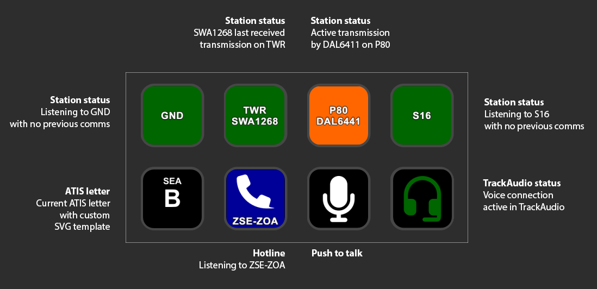
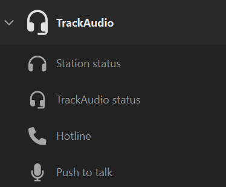
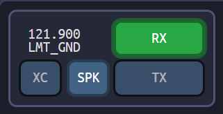
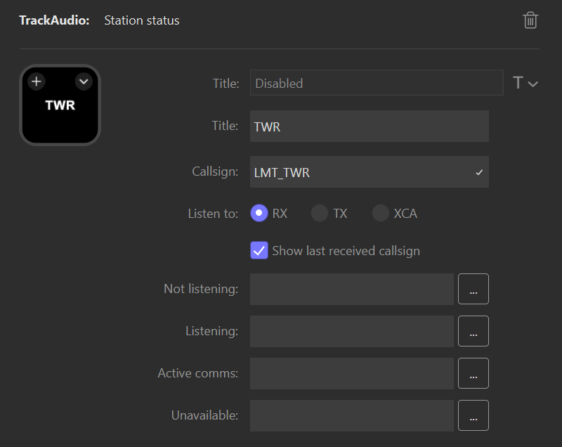

# TrackAudio buttons for StreamDeck <!-- omit from toc -->

This StreamDeck plugin provides actions to interact with [TrackAudio](https://github.com/pierr3/TrackAudio).

- [Action descriptions](#action-descriptions)
- [Configuring a station status action](#configuring-a-station-status-action)
- [Configuring a hotline action](#configuring-a-hotline-action)
- [Configuring a TrackAudio status action](#configuring-a-trackaudio-status-action)
- [Configuring an ATIS letter action](#configuring-an-atis-letter-action)

## Action descriptions

| Action            | Description                                                                                                                |
| ----------------- | -------------------------------------------------------------------------------------------------------------------------- |
| ATIS letter       | Shows the current ATIS letter for a specific station.                                                                      |
| Hotline           | Switches active TX between two stations, typically a primary controlling position and a secondary hotline position.        |
| Push to talk      | Triggers TX on all TX frequencies, as if pressing the push to talk key configured in TrackAudio.                           |
| Station status    | Shows the current RX, TX, XC, or XCA for a specific station. Pressing the action toggles specified state for that station. |
| TrackAudio status | Shows the current state of the connection to TrackAudio from StreamDeck.                                                   |

After installation the plugin actions are available under the TrackAudio category:

## Configuring a station status action

The station status action displays the current status of a single station's button in TrackAudio, including
whether communication is currently active.

For example, to display status of the Rx button for `LMT_GND`, as shown in the image above, configure the
station status action like this:

### Station status settings <!-- omit from toc -->

| Setting                     | Description                                                                                                             |
| --------------------------- | ----------------------------------------------------------------------------------------------------------------------- |
| Title                       | The title to show on the action. If omitted the station callsign and listen to value will be shown.                     |
| Callsign                    | The callsign for the station you want to display status for. Required.                                                  |
| Listen to                   | What status to display on the button, either RX, TX, XC, or XCA. Required.                                              |
| Show last received callsign | When checked, the last received callsign will be appended to the action title. Only applies to actions listening to RX. |
| Not listening               | The image to display when the station is not currently active. Optional, defaults to black.                             |
| Listening                   | The image to display when the station is active. Optional, defaults to green.                                           |
| Active comms                | The image to display when a transmission is actively taking place. Optional, defaults to orange.                        |
| Unavailable                 | The image to display when the station is not added in TrackAudio. Optional, defaults to a warning icon.                 |

## Configuring a hotline action

The hotline action provides a quick way to toggle between two stations for voice transmissions. Start by adding
your primary station in TrackAudio with XCA enabled and the hotline station in TrackAudio with RX enabled.

### Hotline action settings <!-- omit from toc -->

| Setting          | Description                                                                                                                                                                                                                   |
| ---------------- | ----------------------------------------------------------------------------------------------------------------------------------------------------------------------------------------------------------------------------- |
| Primary callsign | The callsign you are actively controlling, for example `SEA_CTR`. Required.                                                                                                                                                   |
| Hotline callsign | The callsign for the hotline, for example `ZOA-ZSE`. Required.                                                                                                                                                                |
| Listening        | The image to display when listening to the hotline frequency. Optional, defaults to blue.                                                                                                                                     |
| Receiving        | The image to display when receiving a transmission on the hotline frequency. Optional, defaults to green.                                                                                                                     |
| Hotline active   | The image to display when transmitting on the hotline frequency. Optional, defaults to orange.                                                                                                                                |
| Both active      | The image to display when both the primary and hotline and frequencies are the active frequency. This should never happen, as it means your voice transmissions will get sent to both frequencies. Optional, defaults to red. |
| Neither active   | The iamge to display when neither the primary nor the hotline frequencies have TX enabled. Optional, defaults to black.                                                                                                       |

## Configuring a TrackAudio status action

The TrackAudio status action shows the status of the connection between StreamDeck and TrackAudio, and whether
the voice connection in TrackAudio is up. Pressing the action will force a state refresh.

### TrackAudio status action settings <!-- omit from toc -->

| Setting         | Description                                                                                       |
| --------------- | ------------------------------------------------------------------------------------------------- |
| Not connected   | The image to display when not connected to TrackAudio. Optional, defaults to white.               |
| Connected       | The image to display when connected to TrackAudio. Optional, defaults to blue.                    |
| Voice connected | The image to display when the TrackAudio voice connection is active. Optional, defaults to green. |

## Configuring an ATIS letter action

**TrackAudio must be running for the ATIS letter to update.**

The ATIS letter action shows the current AITS letter for a station, refreshed automatically every five minutes.
When the ATIS letter updates the action will show an orange background until the action is pressed to reset the
state. Pressing the action when it is not in the updated state will force a refresh of the data from VATSIM.

### ATIS letter action settings <!-- omit from toc -->

| Setting     | Description                                                                                                                                   |
| ----------- | --------------------------------------------------------------------------------------------------------------------------------------------- |
| Title       | The title to show on the action. If omitted no title is shown. The current ATIS letter will be appended to this title separated by a newline. |
| Callsign    | The callsign to get the current AITS letter for, for example `KSEA_ATIS`. Required.                                                           |
| Current     | The image to display when the ATIS letter shown is current. Optional, defaults to black.                                                      |
| Updated     | The image to display when the ATIS letter updated to a new one. Optional, defaults to orange.                                                 |
| Unavailable | The image to display when no ATIS letter is available. Optional, defaults to a warning icon.                                                  |
