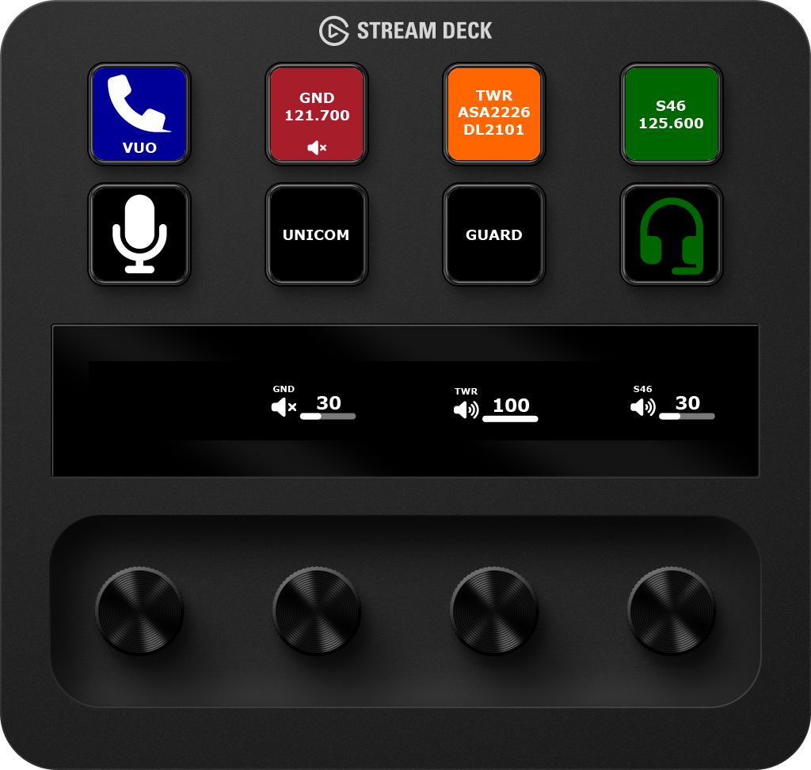

# TrackAudio actions for Stream Deck <!-- omit from toc -->

> [!IMPORTANT]
> This plugin requires [TrackAudio beta 1.3.0-beta.1](https://github.com/pierr3/TrackAudio/releases/tag/1.3.0-beta.5) or later. It will not work with earlier versions of TrackAudio.

This Stream Deck plugin provides actions to interact with TrackAudio.

[Read the documentation](https://projects.neilenns.com/docs/streamdeck-trackaudio) for information on how to set up actions and examples of common configurations. Volume control and mute are coming soon!

Do you use [vATIS](https://vatis.app/) when controlling? Check out the [vATIS actions for Stream Deck plugin](https://github.com/neilenns/streamdeck-vatis).
