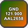
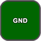
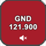
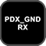
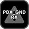
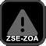
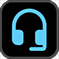
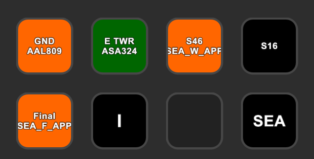
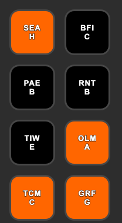

# TrackAudio actions for Stream Deck <!-- omit from toc -->

> [!IMPORTANT]
> This plugin requires [TrackAudio beta 1.3.0-beta.1](https://github.com/pierr3/TrackAudio/releases/tag/1.3.0-beta.1) or later. It will not work with earlier versions of TrackAudio.

This Stream Deck plugin provides actions to interact with TrackAudio. [Get the plugin from the Elgato marketplace](https://marketplace.elgato.com/product/trackaudio-e913a0ca-4c12-411d-a5a6-acf5f6c4bdea). Need inspiration for how to use these actions? Check out the [examples](#examples) section.

Do you use [vATIS](https://vatis.app/) when controlling? Check out the [vATIS actions for Stream Deck plugin](https://github.com/neilenns/streamdeck-vatis).

- [Action descriptions](#action-descriptions)
- [Configuring a station status action](#configuring-a-station-status-action)
- [Configuring a station volume action](#configuring-a-station-volume-action)
- [Configuring a hotline action](#configuring-a-hotline-action)
- [Configuring a TrackAudio status action](#configuring-a-trackaudio-status-action)
- [Configuring an ATIS letter action](#configuring-an-atis-letter-action)
- [Configuring a push to talk action](#configuring-a-push-to-talk-action)
- [SVG templates](#svg-templates)
- [Examples](#examples)
  - [Seattle tower](#seattle-tower)
  - [Seattle final approach - ATIS letters](#seattle-final-approach---atis-letters)

## Action descriptions

| Action            | Description                                                                                                                                                                                                                        |
| ----------------- | ---------------------------------------------------------------------------------------------------------------------------------------------------------------------------------------------------------------------------------- |
| ATIS letter       | Shows the current ATIS letter for a specific station. If you are controlling with [vATIS](https://vatis.app/) use the [vATIS actions for Stream Deck plugin](https://github.com/neilenns/streamdeck-vatis) instead of this action. |
| Hotline           | Switches active TX between two stations, typically a primary controlling position and a secondary hotline position.                                                                                                                |
| Push to talk      | Triggers TX on all TX frequencies, as if pressing the push to talk key configured in TrackAudio.                                                                                                                                   |
| Station status    | Shows the current RX, TX, or XCA for a specific station. Pressing the action toggles specified state for that station. Also shows the last received callsign by the station.                                                       |
| TrackAudio status | Shows the current state of the connection to TrackAudio from Stream Deck and whether TrackAudio is voice connected to VATSIM.                                                                                                      |

After installation the plugin actions are available under the TrackAudio category:

## Configuring a station status action

The station status action displays the current status of a single station's button in TrackAudio, including
whether communication is currently active. It also automatically adds the station to TrackAudio after
a voice connection is established.

Pressing the action will either toggle the equivalent button in TrackAudio or mute the station's audio.
A long press of the action will refresh the action's state.

For example, if you are controlling `LMT_TWR` and have TrackAudio set up like this:

configure the station status action like this to show that RX is enabled and the last received callsign:

> [!IMPORTANT]
> The action lights up when transmissions occur on the _frequency_ of the callsign. This means if two stations share the same frequency (e.g. `PDX_GND` and `GEG_GND`) the action will light up when transmissions happen on either of those stations.

### Station status settings <!-- omit from toc -->

| Setting                           | Description                                                                                                                                                                                                                  | Default                                                                    |
| --------------------------------- | ---------------------------------------------------------------------------------------------------------------------------------------------------------------------------------------------------------------------------- | -------------------------------------------------------------------------- |
| Title                             | The title to show on the action. Optional.                                                                                                                                                                                   | Station callsign and listen to value                                       |
| Callsign                          | The callsign for the station you want to display status for. Required.                                                                                                                                                       |                                                                            |
| Listen to                         | What status to display on the button, either RX, TX, or XCA. Required.                                                                                                                                                       | RX                                                                         |
| Last received callsigns           | Sets the number of last received callsigns to display, newest to oldest, and will age off after five minutes. Only supported when listen to is set to `RX` or `XCA`. If set to `0` no last received callsigns will be shown. | `0`                                                                        |
| Toggle mute when pressed          | Toggles mute for the station when the action is pressed instead of toggling the configured listen to button.                                                                                                                 | false                                                                      |
| Active comms                      | The image to display when a transmission is actively taking place. Optional.                                                                                                                                                 |               |
| Blocked                           | The image to display when both an aircraft and the ATC position are transmitting at the same time. Optional.                                                                                                                 |  |
| Listening                         | The image to display when the station is active. Optional.                                                                                                                                                                   |                |
| Muted                             | The iamge to display when the station is muted. Optional.                                                                                                                                                                    |       |
| Not listening                     | The image to display when the station is not currently active. Optional.                                                                                                                                                     |             |
| Unavailable                       | The image to display when the station is not added in TrackAudio. Optional, defaults to a warning icon.                                                                                                                      |                  |
| Automatically enable speaker mode | Enables speaker mode on the station after a TrackAudio voice connection is established                                                                                                                                       | false                                                                      |
| Automatically set Rx mode         | Enables Rx mode on the station after a TrackAudio voice connection is established                                                                                                                                            | false                                                                      |
| Show callsign                     | Show the callsign on the action.                                                                                                                                                                                             | false                                                                      |
| Show frequency                    | Show the callsign's frequency on the action.                                                                                                                                                                                 | false                                                                      |
| Show listen to                    | Show the listen to value on the action.                                                                                                                                                                                      | false                                                                      |
| Show title                        | Show the title on the action.                                                                                                                                                                                                | true                                                                       |
| Clear callsigns after (minutes)   | How long to leave callsigns displayed before they age off. Set to 0 to persist callsigns until they are pushed by newer callsigns.                                                                                           | 3 minutes                                                                  |

## Configuring a station volume action

The station volume action displays the current volume of a specific station and enables changing the volume, as well as muting
the station. This action requires a dial control, available on the [Stream Deck +](https://www.elgato.com/us/en/p/stream-deck-plus-black).

Turning the knob will adjust the station volume. Pressing the knob will toggle mute
for the station.

### Station volume settings <!-- omit from toc -->

| Setting       | Description                                                                                             | Default |
| ------------- | ------------------------------------------------------------------------------------------------------- | ------- |
| Callsign      | The callsign for the station you want to control the volume of. Required.                               |         |
| Change amount | The size of volume change to make on each click of the knob.                                            | 1       |
| Muted         | The image to display when the station is muted in TrackAudio. Optional, defaults to a muted icon.       |         |
| Not muted     | The image to display when the station is not muted in TrackAudio. Optional, defaults to a volume icon.  |         |
| Title         | The title to display on the callsign. Optional.                                                         |         |
| Unavailable   | The image to display when the station is not added in TrackAudio. Optional, defaults to a warning icon. |         |

## Configuring a hotline action

The hotline action provides a quick way to toggle between two stations for voice transmissions. This is typically
used by center controllers who have a hotline frequency established with neighbouring sectors.
It also automatically adds the primary and hotline stations to TrackAudio after a voice connection is established.

To use the hotline action start by adding the appropriate stations to TrackAudio. Your primary station should
be added with `XCA` enabled and the hotline station should be added with `RX` enabled. Then configure the
hotline action with the primary and hotline station callsigns.

Once configured, pressing the action will toggle `TX` active between your primary and hotline frequencies.
A long press of the action will refresh the action's state.

### Hotline action settings <!-- omit from toc -->

| Setting               | Description                                                                                                                                                                                                  | Default                                                             |
| --------------------- | ------------------------------------------------------------------------------------------------------------------------------------------------------------------------------------------------------------ | ------------------------------------------------------------------- |
| Primary callsign      | The callsign you are actively controlling, for example `SEA_CTR`. Required.                                                                                                                                  |                                                                     |
| Hotline callsign      | The callsign for the hotline, for example `ZOA-ZSE`. Required.                                                                                                                                               |                                                                     |
| Both active           | The image to display when both the primary and hotline and frequencies are the active frequency. This should never happen, as it means your voice transmissions will get sent to both frequencies. Optional. |         |
| Hotline active        | The image to display when transmitting on the hotline frequency. Optional.                                                                                                                                   |    |
| Listening             | The image to display when listening to the hotline frequency. Optional.                                                                                                                                      |   |
| Neither active        | The iamge to display when neither the primary nor the hotline frequencies have TX enabled. Optional.                                                                                                         |    |
| Receiving             | The image to display when receiving a transmission on the hotline frequency. Optional.                                                                                                                       |  |
| Unavailable           | The image to display when the primary and hotline stations are not added in TrackAudio. Optional.                                                                                                            |                 |
| Show hotline callsign | Show the hotline callsign on the action.                                                                                                                                                                     | false                                                               |
| Show primary callsign | Show the primary callsign on the action.                                                                                                                                                                     | false                                                               |
| Show title            | Show the title on the action.                                                                                                                                                                                | true                                                                |

## Configuring a TrackAudio status action

The TrackAudio status action shows the status of the connection between Stream Deck and TrackAudio, and whether
the voice connection in TrackAudio is up. A long press of the action will force a refresh of all the Stream Deck
TrackAudio actions.

### TrackAudio status action settings <!-- omit from toc -->

| Setting         | Description                                                                    | Default                                                                           |
| --------------- | ------------------------------------------------------------------------------ | --------------------------------------------------------------------------------- |
| Connected       | The image to display when connected to TrackAudio. Optional.                   |        |
| Not connected   | The image to display when not connected to TrackAudio. Optional.               |    |
| Voice connected | The image to display when the TrackAudio voice connection is active. Optional. |  |
| Show title      | Show the title on the action.                                                  | false                                                                             |

## Configuring an ATIS letter action

> [!IMPORTANT]
> If you are actively controlling with [vATIS](https://vatis.app/) use the [vATIS actions for Stream Deck plugin](https://github.com/neilenns/streamdeck-vatis) instead to get
> real-time ATIS updates on your Stream Deck.
>
> For this action to work TrackAudio must be running and you must be connected for the ATIS letter to update.
> It can take five minutes or longer for the VATSIM data source to refresh and reflect the latest ATIS letter.

The ATIS letter action shows the current AITS letter for a station, refreshed automatically every minute.
When the ATIS letter updates the action will show an orange background until the action is pressed to reset the
state. A long press of the action will force a refresh of the ATIS information.

See the [SVG template documentation](https://github.com/neilenns/streamdeck-trackaudio/wiki/SVG-templates) for an example
template that shows the title small and station letter big.

### ATIS letter action settings <!-- omit from toc -->

| Setting                     | Description                                                                                                               | Default                                            |
| --------------------------- | ------------------------------------------------------------------------------------------------------------------------- | -------------------------------------------------- |
| Title                       | The title to show on the action. The current ATIS letter will be appended to this title separated by a newline. Optional. | Blank                                              |
| Callsign                    | The callsign to get the current AITS letter for, for example `KSEA_ATIS`. Required.                                       |                                                    |
| Current                     | The image to display when the ATIS letter shown is current. Optional.                                                     |   |
| Unavailable                 | The image to display when no ATIS letter is available. Optional.                                                          |   |
| Updated                     | The image to display when the ATIS letter updated to a new one. Optional.                                                 |  |
| Automatically clear updates | Clears the updated state automatically after two minutes. Pressing the action will always clear the update state.         | true                                               |
| Show letter                 | Show the letter on thea ction.                                                                                            | true                                               |
| Show title                  | Show the title on the action.                                                                                             | true                                               |

## Configuring a push to talk action

The push to talk action does not require configuration for use. Simply add it to your profile, then press the action to start transmitting.

| Setting          | Description                                 | Default                                                                |
| ---------------- | ------------------------------------------- | ---------------------------------------------------------------------- |
| Title            | The title to show on the action. Optional.  |                                                                        |
| Not transmitting | Shown when idle. Optional.                  |           |
| Transmitting     | Shown when actively transmitting. Optional. |  |
| Show title       | Show the title on the action.               | false                                                                  |

## SVG templates

All image properties support SVG templates using [Handlebars](https://handlebarsjs.com/). This enables using a single SVG image across multiple
actions, for example a single image to do custom display of ATIS letters with a station name. For more information on the available template
variables see the [documentation on the wiki](https://github.com/neilenns/streamdeck-trackaudio/wiki/SVG-templates).

## Examples

Here are some examples of different profiles people have created using these actions. Have an example you'd like to
share? [Open a new issue](https://github.com/neilenns/streamdeck-trackaudio/issues/new/choose) with a screenshot and
details of how you have the actions configured.

### Seattle tower

Used by a Seattle Tower controller to listen to the controllers working above and below, and to quickly
turn those stations off when it gets busy.

The actions are configured as follows, from left to right, top to bottom.

| Action         | Settings                                                                                                                        |
| -------------- | ------------------------------------------------------------------------------------------------------------------------------- |
| Station status | **Title**: GND, **Callsign**: SEA_GND, **Listen to**: RX, **Show title**: checked, **Show last callsigns**: 1                   |
| Station status | **Title**: E TWR, **Callsign**: SEA_E_TWR, **Listen to**: XCA, **Show title**: checked, **Show last callsigns**: 1              |
| Station status | **Title**: S46, **Callsign**: SEA_W_APP, **Listen to**: RX, **Show title**: checked, **Show last callsigns**: 1                 |
| Station status | **Title**: S16, **Callsign**: SEA_CTR, **Listen to**: RX, **Show title**: checked, **Show last callsigns**: 1                   |
| Station status | **Title**: Final, **Callsign**: SEA_F_APP, **Listen to**: RX, **Show title**: checked, **Show last received callsign**: checked |
| ATIS letter    | **Title**: _blank_, **Callsign**: KSEA_ATIS, **Show title**: unchecked, **Show letter**: checked                                |
| Switch profile | **Title**: SEA                                                                                                                  |

### Seattle final approach - ATIS letters

Used by a final approach controller to keep an eye on the current ATIS letter for all the satellite fields around KSEA.

The actions are configured as follows, from left to right, top to bottom.

| Action      | Settings                                                                                   |
| ----------- | ------------------------------------------------------------------------------------------ |
| ATIS letter | **Title**: SEA, **Callsign**: KSEA_ATIS, **Show title**: checked, **Show letter**: checked |
| ATIS letter | **Title**: BFI, **Callsign**: KBFI_ATIS, **Show title**: checked, **Show letter**: checked |
| ATIS letter | **Title**: PAE, **Callsign**: KPAE_ATIS, **Show title**: checked, **Show letter**: checked |
| ATIS letter | **Title**: RNT, **Callsign**: KRNT_ATIS, **Show title**: checked, **Show letter**: checked |
| ATIS letter | **Title**: TIW, **Callsign**: KTIW_ATIS, **Show title**: checked, **Show letter**: checked |
| ATIS letter | **Title**: OLM, **Callsign**: KOLM_ATIS, **Show title**: checked, **Show letter**: checked |
| ATIS letter | **Title**: TCM, **Callsign**: KTCM_ATIS, **Show title**: checked, **Show letter**: checked |
| ATIS letter | **Title**: GRF, **Callsign**: KGRF_ATIS, **Show title**: checked, **Show letter**: checked |
